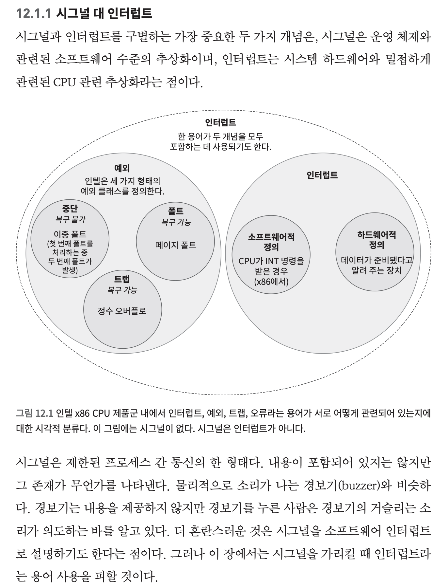

# 배경 개념

- **자원(resource)**: 프로그램이 실행되기 위해 필요한 하드웨어 또는 운영체제 관리 대상이다. 대표적으로 CPU, 메모리, 파일, 장치가 있다.
- **자원 가상화(resource virtualization)**: 실제 하드웨어 자원을 프로그램에 직접 노출하지 않고, 운영체제가 추상화된 형태로 제공하는 방식이다.
- **커널(kernel)**: 하드웨어 자원에 대한 권한을 가지고, 사용자 프로그램의 요청을 검사하고 수행하는 운영체제의 핵심 부분이다.
- **보호(protection)**: 한 프로그램이나 장치가 다른 프로그램 또는 커널의 자원을 침범하지 못하도록 접근 범위를 제한하는 원리이다.

# 자원 가상화(Resource Virtualization)

자원 가상화는 운영체제가 메모리와 I/O 장치 같은 하드웨어 자원을 직접 드러내지 않고, 프로그램이 안전하고 일관된 방식으로 사용할 수 있도록 추상화하는 방식이다. 프로그램은 자신만의 메모리 공간과 자원을 사용하는 것처럼 보지만, 실제 위치, 할당 시점, 접근 권한은 운영체제와 하드웨어가 관리한다.

1. **주소 공간 가상화(Address Space Virtualization)**: 프로세스마다 독립적인 가상 주소 공간을 제공하고, 이를 물리 메모리에 매핑하는 방식
2. **지연 할당과 페이지 기반 관리(Lazy Allocation & Page-Based Management)**: 실제 자원 할당을 필요한 시점까지 미루고, 페이지 단위로 메모리를 관리하는 방식
3. **보호된 접근과 커널 중재(Protected Access & Kernel Mediation)**: 사용자 프로그램과 장치의 위험한 자원 접근을 커널과 하드웨어가 통제하는 방식

```text
자원 가상화
├─ 1. 주소 공간 가상화
│  ├─ 가상메모리
│  └─ 페이징
├─ 2. 지연 할당과 페이지 기반 관리
│  ├─ demand-zero memory
│  ├─ 페이지 폴트
│  └─ 물리 페이지 할당
└─ 3. 보호된 접근과 커널 중재
   ├─ 시스템콜
   ├─ DMA
   └─ 접근 권한 통제
```

## 1. 주소 공간 가상화

- **가상메모리(virtual memory)**: 각 프로세스가 자신만의 독립적인 메모리 공간을 가진 것처럼 보이게 하는 추상화
- **페이징(paging)**: 가상 주소 공간과 물리 메모리를 고정 크기의 페이지 단위로 나누어 매핑하는 방식

주소 공간 가상화의 핵심은 프로그램이 실제 물리 메모리 주소를 직접 다루지 않는다는 점이다. 프로그램은 가상 주소를 사용하고, 운영체제와 MMU가 가상 주소를 물리 주소로 변환한다.

이 구조 덕분에 각 프로세스는 서로 분리된 주소 공간을 가지며, 한 프로세스가 다른 프로세스의 메모리를 함부로 읽거나 쓸 수 없다. 또한 가상 주소 공간은 연속적으로 보일 수 있지만, 실제 물리 메모리에서는 여러 위치에 흩어져 배치될 수 있다.

## 2. 지연 할당과 페이지 기반 관리

- **demand-zero memory**: 메모리 영역을 요청받았을 때 즉시 물리 페이지를 할당하지 않고, 처음 접근할 때 0으로 초기화된 페이지를 할당하는 방식
- **페이지 폴트(page fault)**: 접근한 가상 페이지가 아직 물리 메모리에 매핑되어 있지 않을 때 발생하는 예외
- **물리 페이지 할당(physical page allocation)**: 페이지 폴트 처리 과정에서 실제 물리 메모리 페이지를 준비해 가상 주소에 연결하는 작업

지연 할당은 자원을 요청받은 순간이 아니라 실제로 사용되는 순간에 할당하는 방식이다. 프로그램이 큰 메모리 영역을 요청하더라도, 운영체제는 모든 물리 페이지를 즉시 준비하지 않을 수 있다.

demand-zero memory가 대표적인 예이다. 프로그램이 새 메모리 영역에 처음 접근하면 페이지 폴트가 발생하고, 커널은 그때 0으로 초기화된 물리 페이지를 할당해 가상 주소에 매핑한다.

이 방식은 페이징을 기반으로 동작한다. 메모리를 페이지 단위로 나누어 관리하기 때문에, 실제로 접근한 페이지만 할당할 수 있다. 결과적으로 운영체제는 사용되지 않는 메모리에 물리 자원을 낭비하지 않고, 필요한 부분에만 자원을 제공할 수 있다.



## 3. 보호된 접근과 커널 중재

- **시스템콜(system call)**: 사용자 프로그램이 커널 기능을 요청하기 위해 사용하는 공식 인터페이스
- **DMA(Direct Memory Access)**: 장치가 CPU를 거치지 않고 메모리에 직접 데이터를 읽거나 쓰는 방식
- **접근 권한 통제(access control)**: 사용자 프로그램이나 장치가 접근할 수 있는 자원의 범위를 제한하는 관리 방식

보호된 접근과 커널 중재의 핵심은 프로그램이나 장치가 하드웨어 자원에 직접 무제한으로 접근하지 못하게 하는 것이다.

사용자 프로그램은 파일, 메모리, 장치 같은 중요한 자원을 직접 조작할 수 없다. 대신 시스템콜을 통해 커널에 요청해야 한다. 커널은 요청이 유효한지, 권한이 있는지, 현재 상태에서 수행 가능한지를 검사한 뒤 실제 작업을 수행한다.

DMA는 장치가 메모리에 직접 접근하므로 성능 면에서 효율적이다. 하지만 장치의 접근 범위를 제한하지 않으면 다른 프로세스나 커널 메모리를 침범할 수 있다. 따라서 DMA 역시 운영체제와 하드웨어의 통제 대상이며, 필요한 경우 IOMMU 같은 기능을 통해 장치의 메모리 접근도 제한하고 가상화한다.

## 전체 관계 요약

| 하위 핵심 개념 | 관련 주제 | 핵심 역할 |
| --- | --- | --- |
| 주소 공간 가상화 | 가상메모리, 페이징 | 프로세스마다 독립적인 가상 주소 공간을 제공한다. |
| 지연 할당과 페이지 기반 관리 | demand-zero memory, 페이징 | 필요한 시점에 필요한 페이지를 실제로 할당한다. |
| 보호된 접근과 커널 중재 | 시스템콜, DMA | 위험한 자원 접근을 커널과 하드웨어가 통제한다. |

---

# 그 외

* 가상메모리와 페이징은 주로 메모리 자원을 가상화하는 메커니즘이다.
* demand-zero memory는 페이징을 활용해 실제 물리 메모리 할당을 늦추는 최적화이다.
* 시스템콜은 사용자 프로그램이 커널 자원에 접근하기 위한 보호된 진입점이다.
* DMA는 장치가 메모리에 직접 접근하는 방식이므로, 성능 최적화인 동시에 강한 접근 통제가 필요한 영역이다.
* `유저 코드 - 시스템콜 인터페이스 - 커널/운영체제 - MMU/IOMMU - 물리 메모리/장치`처럼 수준을 나누어 생각하면 더 명확하다.
